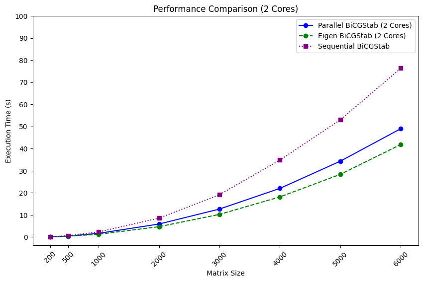
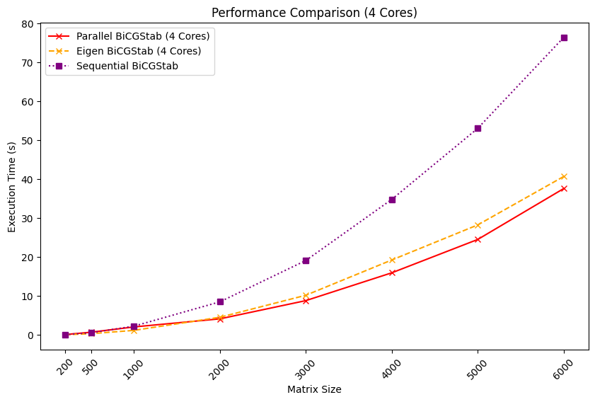

# bicgstab-omp
## Table of Contents
- [Team Members](#-team-members)
- [About](#-about)
- [How to Build](#-how-to-build)
- [Challenges](#-challenges)
- [Comparison](#-comparison)
- [Conclusion](#-conclusion)

## Team members
- **Stepanishchev Stepan**: https://t.me/geekysteve
    
    Responsibilities: main algorithm logic and architecture, code review

- **Semen Borodin**: https://t.me/Pabagandas

    Responsibilities: research, metrics, figures, io

- **Yana Dementieva**: https://t.me/muz_bum123

    Responsibilities: tests, benchmarking

## About
_Brief BiCGStab overview_
> BCG is a projection algorithm for solving Ax = b. The main idea
is to assume that residual and its conjugate vectors are polinomial of matrix A
of degree j on each j step. But there are situations (floating point truncation)
in which BCG can't produce appropriate solution. So here comes BiCGStab. We assume
that residual and conjugate vectors is a product of polymonial from BCG and 
the new one responsible for "stabilization" on each step. For more information
about theoretical nuances ask https://t.me/geekysteve.

## How to build
Just run ```make``` inside a project directory

## Challenges
Since BiCGStab relies on previous result on each step, the main goal is to parallel matrix vector product. Sparse matrices are pain in the ass because in such problems the ratio
between computation and memory-access time is very low. Sparse matrices require indirect addressing for accessing non-zero elements making it difficult to predict which parts of the matrix will be needed next. This property make caching more complex.

## Comparison
All runs was made with `tolerance = 1e-6` and `max_iter = 2 * col_num`




## Conclusion
As we can see, our simple parallel optimization outperforms sequential version twicely on a 6000*6000 matrix. And we even outrun Eigens BiCGStab on 4 cores for a little. Unfortunately, our testing machine has only one Numa node, so adding matrix-fill optimization had no effect.

